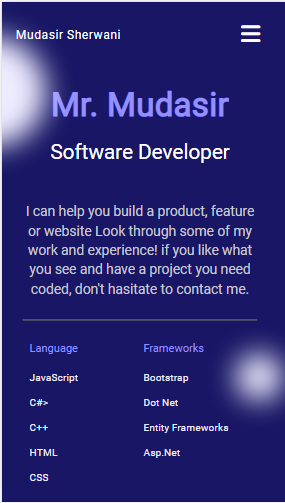
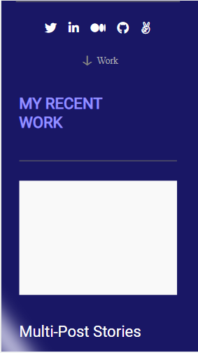
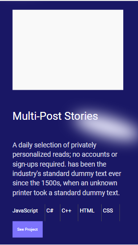
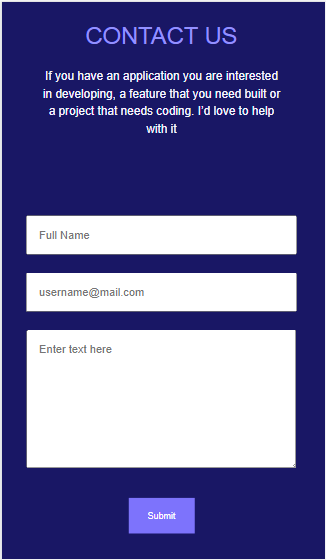

# Protfolio

> This is Portfolio project in Mobile View only with two sections.This project developement assing by Microverse.
> In the Mobile View Portfolio there are few important sections are visible.
> This project has done after getting templete from FIGMA templete #4.

## Working Modules

- First 2 Sections are Working Toolbar and Header Section.
- Project Area work done.
- Contact Form Submit to https://formspree.io/
- Footer with social icons

## Built With

- HTML
- CSS > FlexBox

## Extensions / Plugins

Linters Installed
-Lighthouse
-Webhint
-Stylelint
-ESLint
-node_modules checker

## Getting Started
- Open GitHub URL of repositry.
- Download Code repo in zip.
- Extract and open repo folder into visual studio code or any other Text Editor Software.
- GitHub Repositry URL: https://github.com/MudasirSherwani/Portfolio
  To get a local copy up and running follow these simple example steps.

### Prerequisites
- Visual Studio
- Knowldege About HTML / CSS
Linters
- Lighthouse
- Webhint
- Stylelint
- ESLint
- node_modules checker
- Github

### Deployment
- [Linter](https://github.com/microverseinc/linters-config/tree/master/html-css)

## Authors

👤 **Mudasir Sherwani**

- GitHub: [@Mudasir Sherwani](https://github.com/MudasirSherwani)
- Twitter: [@Mudasir Sherwani](https://twitter.com/mudasirsherwani)
- LinkedIn: [Mudasir Sherwani](https://linkedin.com/in/mudasir-ashraf-071321a4)

## 🤝 Contributing

Contributions, issues, and feature requests are welcome!

Feel free to check the [issues page](../../issues/).

## Show your support

Give a ⭐️ if you like this project!

## Acknowledgments

- microverseinc
- Inspiration
- etc

## 📝 License
https://github.com/MudasirSherwani/Portfolio/blob/main/LICENSE.md
This project is [MIT](./MIT.md) licensed.

